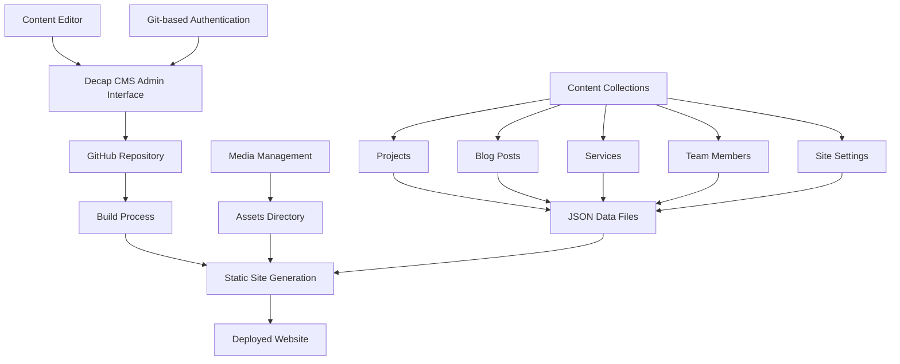

# Design Document

## Overview

The Decap CMS implementation for the Monisa Construction Company website will provide a Git-based content management system that integrates seamlessly with the existing static HTML structure. The design leverages Decap CMS's ability to manage content through YAML frontmatter and Markdown files while maintaining the current website's visual design and functionality.

The system will transform the existing static content into a dynamic, manageable structure where content editors can update projects, blog posts, services, team members, and site settings through an intuitive web interface. All content changes will be version-controlled through Git and automatically deployed to maintain the current hosting setup.

## Architecture

### System Architecture



### Content Flow Architecture

1. **Content Creation/Editing**: Content managers use the Decap CMS admin interface at `/admin`
2. **Data Storage**: Content is stored as Markdown files with YAML frontmatter in organized collections
3. **Build Process**: A build script processes the Markdown files and generates JSON data files
4. **Integration**: The existing JavaScript code consumes the JSON data to populate the HTML templates
5. **Deployment**: Changes trigger automatic deployment to update the live website

### File Structure Design

```
/
├── admin/
│   ├── index.html          # Decap CMS admin interface
│   └── config.yml          # CMS configuration
├── content/
│   ├── projects/           # Project collection
│   │   ├── luxury-villa.md
│   │   ├── commercial-office.md
│   │   └── ...
│   ├── blog/              # Blog posts collection
│   │   ├── 2024-01-15-construction-trends.md
│   │   └── ...
│   ├── services/          # Services collection
│   │   ├── residential-construction.md
│   │   └── ...
│   ├── team/              # Team members collection
│   │   ├── john-mwalimu.md
│   │   └── ...
│   └── settings/          # Site settings
│       └── site-config.md
├── assets/
│   ├── data/              # Generated JSON files
│   │   ├── projects.json
│   │   ├── blog.json
│   │   ├── services.json
│   │   ├── team.json
│   │   └── site-settings.json
│   └── uploads/           # CMS uploaded media
└── scripts/
    └── build-content.js   # Content processing script
```

## Components and Interfaces

### Decap CMS Configuration

The CMS will be configured with the following collections:

#### Projects Collection
- **Purpose**: Manage construction project portfolio
- **Fields**: Title, category, status, location, description, images, specifications, timeline, team, client testimonial
- **File Format**: Markdown with YAML frontmatter
- **Slug Pattern**: `{{slug}}`

#### Blog Collection
- **Purpose**: Manage blog posts and news articles
- **Fields**: Title, date, author, excerpt, featured image, content, tags, published status
- **File Format**: Markdown with YAML frontmatter
- **Slug Pattern**: `{{year}}-{{month}}-{{day}}-{{slug}}`

#### Services Collection
- **Purpose**: Manage service offerings
- **Fields**: Title, description, category, icon, pricing info, features list
- **File Format**: Markdown with YAML frontmatter
- **Slug Pattern**: `{{slug}}`

#### Team Collection
- **Purpose**: Manage team member profiles
- **Fields**: Name, position, bio, photo, contact info, social links
- **File Format**: Markdown with YAML frontmatter
- **Slug Pattern**: `{{slug}}`

#### Site Settings
- **Purpose**: Manage global site configuration
- **Fields**: Company info, contact details, social media links, SEO settings
- **File Format**: Single YAML file
- **Location**: `content/settings/site-config.md`

### Content Processing Interface

#### Build Script (`scripts/build-content.js`)
- **Input**: Markdown files from content collections
- **Output**: JSON data files in `assets/data/`
- **Functions**:
  - Parse YAML frontmatter and Markdown content
  - Generate structured JSON for each collection
  - Optimize images and handle media references
  - Validate required fields and data integrity

#### Data Integration Layer
- **Existing JavaScript files** will be updated to consume JSON data
- **Template rendering** will use the generated JSON to populate HTML
- **Dynamic content loading** for projects, blog posts, and other collections

### Authentication and Security

#### Git-based Authentication
- **Provider**: GitHub OAuth
- **Permissions**: Repository write access for content editors
- **User Management**: Through GitHub repository collaborators

#### Content Validation
- **Required Fields**: Enforced through CMS configuration
- **Image Optimization**: Automatic resizing and compression
- **Content Sanitization**: Markdown parsing with XSS protection

## Data Models

### Project Data Model

```yaml
# Example: content/projects/luxury-villa.md
---
title: "Luxury Villa Construction"
category: "Residential"
status: "Completed"
location: "Dar es Salaam"
completionDate: "2024-03-15"
duration: "8 months"
budget: "$450,000"
shortDescription: "Premium 4-bedroom villa with modern architecture"
images:
  main: "/assets/imgs/projects/villa-main.jpg"
  gallery:
    - "/assets/imgs/projects/villa-1.jpg"
    - "/assets/imgs/projects/villa-2.jpg"
specifications:
  area: "3,500 sq ft"
  bedrooms: 4
  bathrooms: 3
  floors: 2
  materials:
    - "Reinforced concrete"
    - "Premium tiles"
features:
  - "Swimming pool"
  - "Landscaped garden"
timeline:
  - phase: "Foundation & Structure"
    duration: "2 months"
    status: "completed"
team:
  projectManager: "John Mwalimu"
  architect: "Sarah Hassan"
client:
  name: "Mr. & Mrs. Abdallah"
  testimonial: "Exceeded our expectations..."
  rating: 5
featured: true
---

Full project description content in Markdown format...
```

### Blog Post Data Model

```yaml
# Example: content/blog/2024-01-15-construction-trends.md
---
title: "2024 Construction Industry Trends in Tanzania"
date: "2024-01-15"
author: "John Mwalimu"
excerpt: "Exploring the latest trends shaping construction in Tanzania"
featuredImage: "/assets/imgs/blog/construction-trends.jpg"
tags:
  - "Industry Trends"
  - "Construction"
  - "Tanzania"
published: true
---

Blog post content in Markdown format...
```

### Service Data Model

```yaml
# Example: content/services/residential-construction.md
---
title: "Residential Construction"
category: "Construction Services"
icon: "home"
description: "Complete residential construction services"
features:
  - "Custom home design"
  - "Quality materials"
  - "Timely delivery"
pricing:
  startingFrom: "$200,000"
  unit: "project"
order: 1
---

Detailed service description in Markdown...
```

### Team Member Data Model

```yaml
# Example: content/team/john-mwalimu.md
---
name: "John Mwalimu"
position: "Project Manager"
photo: "/assets/imgs/team/john-mwalimu.jpg"
email: "john@monisa.com"
phone: "+255 123 456 789"
bio: "Experienced project manager with 10+ years in construction"
socialLinks:
  linkedin: "https://linkedin.com/in/johnmwalimu"
  twitter: "https://twitter.com/johnmwalimu"
order: 1
---

Extended bio content in Markdown...
```

### Site Settings Data Model

```yaml
# content/settings/site-config.md
---
company:
  name: "Monisa Construction Company"
  tagline: "Building Excellence Since 2010"
  description: "Leading construction company in Tanzania"
contact:
  address: "Makongo Juu, Dar es Salaam"
  phone: "+255 757 015 247"
  email: "info@monisa.com"
  whatsapp: "+255757015247"
social:
  facebook: "https://www.facebook.com/monisa"
  twitter: "https://twitter.com/monisa"
  linkedin: "https://www.linkedin.com/company/monisa"
  instagram: "https://www.instagram.com/monisa"
seo:
  title: "Monisa - Construction Company"
  description: "Professional construction services in Tanzania"
  keywords: "construction, building, Tanzania, residential, commercial"
---
```

## Error Handling

### Content Validation Errors
- **Missing Required Fields**: CMS will prevent saving incomplete content
- **Invalid Data Types**: Type validation for dates, numbers, and URLs
- **Image Upload Errors**: Fallback to placeholder images and error notifications
- **Build Process Failures**: Email notifications to administrators with error details

### System Error Handling
- **Authentication Failures**: Clear error messages and retry mechanisms
- **Git Commit Errors**: Automatic retry with exponential backoff
- **Build Script Errors**: Detailed logging and rollback to previous version
- **Deployment Failures**: Notification system and manual deployment triggers

### User Experience Error Handling
- **Network Connectivity**: Offline editing capabilities with sync when online
- **Browser Compatibility**: Progressive enhancement for older browsers
- **Mobile Responsiveness**: Touch-friendly interface for mobile content editing
- **Auto-save Functionality**: Prevent data loss during editing sessions

## Testing Strategy

### Unit Testing
- **Content Processing**: Test Markdown parsing and JSON generation
- **Data Validation**: Test field validation and error handling
- **Image Processing**: Test image optimization and upload handling
- **Build Scripts**: Test content compilation and file generation

### Integration Testing
- **CMS to Git Integration**: Test content saving and version control
- **Build Process Integration**: Test end-to-end content publishing
- **Website Integration**: Test JSON data consumption by existing JavaScript
- **Authentication Integration**: Test GitHub OAuth and permissions

### User Acceptance Testing
- **Content Editor Workflows**: Test common editing scenarios
- **Media Management**: Test image upload and organization
- **Content Publishing**: Test draft to published workflows
- **Mobile Editing**: Test CMS functionality on mobile devices

### Performance Testing
- **Build Time Performance**: Optimize content processing speed
- **Image Optimization**: Test automated image compression
- **Website Load Times**: Ensure CMS doesn't impact site performance
- **Concurrent Editing**: Test multiple users editing simultaneously

### Security Testing
- **Authentication Security**: Test OAuth implementation and session management
- **Content Sanitization**: Test XSS prevention in Markdown content
- **File Upload Security**: Test image upload restrictions and validation
- **Access Control**: Test user permissions and content access restrictions